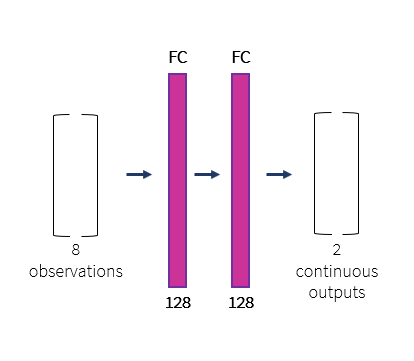
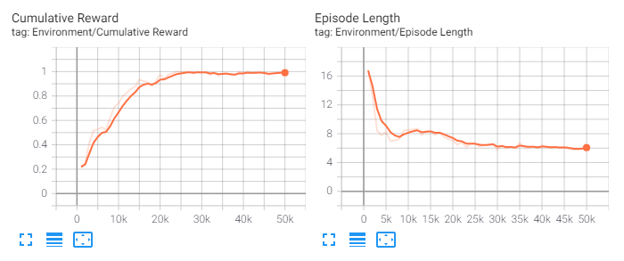
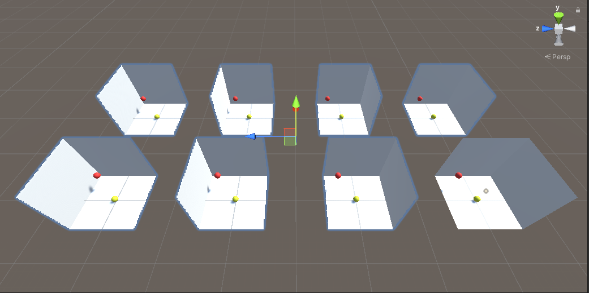
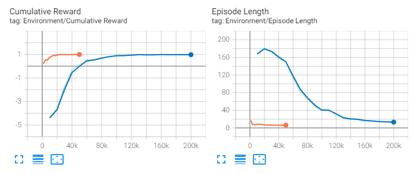
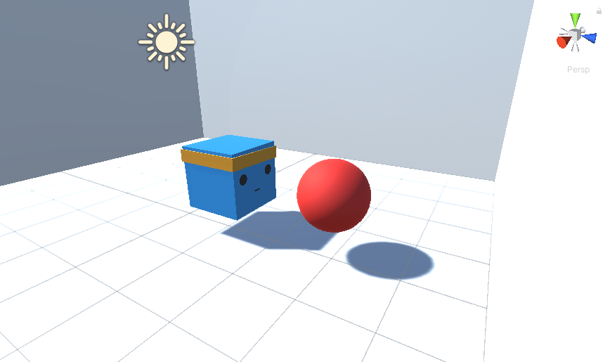
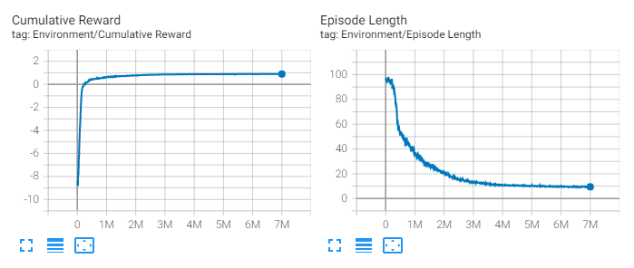
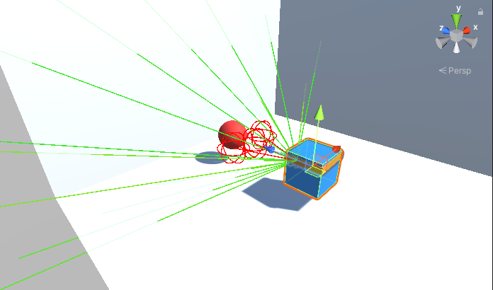
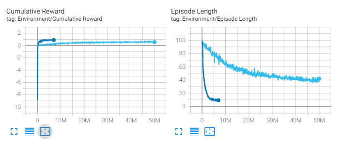
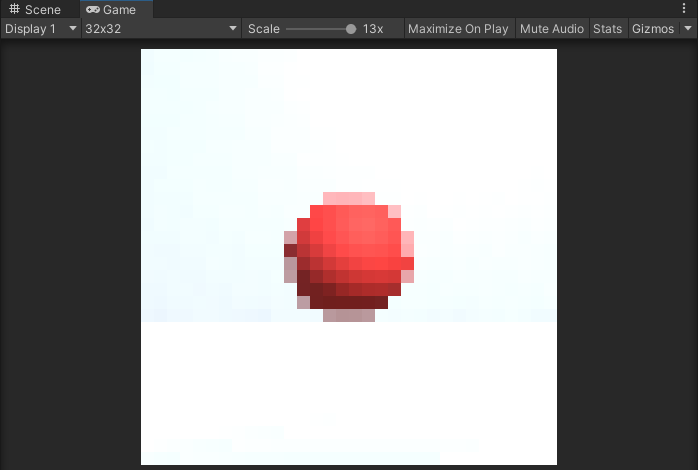
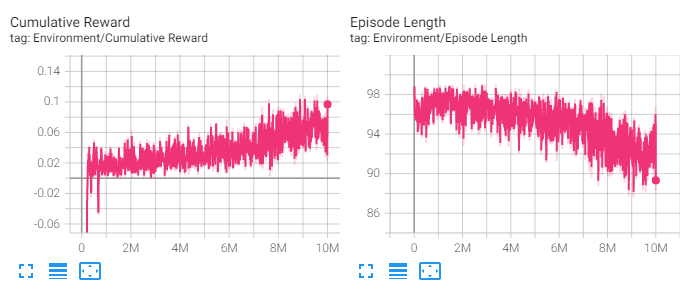

# Full Stack Deep Learning Course Project Write-Up

For my FSDL project I decided to learn about the basic theory and application of reinforcement learning in the <a href="https://unity.com/">Unity game engine</a>.

Unity Technologies provide a well-documented toolkit to carry out the training of agents in game environments, as such this was a convenient introduction point to RL for a beginner like me. Despite this, starting from zero knowledge of Unity or RL meant that there was a fair degree of learning curve to successfully train an agent in a unique environment, as well as understand what was going on under the hood. This report will walk through the journey I took to get there.

## Getting started with Unity and the ML-Agents Toolkit - Installation and Basics

The Unity Machine Learning Agents Toolkit is an open-source project that allows anyone to easily apply state-of-the-art algorithms to agents in game environments. Installation was straightforward and consisted of:

- Installing Unity on my local machine
- Cloning the ML-Agents Toolkit repo to my local machine
- Installing the mlagents Python package from PyPi
- Adding a package to my project within the Unity Game Engine itself (com.unity.ml-agents)

I then ran though <a href="https://github.com/Unity-Technologies/ml-agents/blob/release_17_docs/docs/Getting-Started.md">Getting Started Guide</a> to verify the installation.

Before starting on ML-Agents I did the introductory tutorials on Unity itself to familiarise myself with the platform. I also watched this YouTube video: <a href="https://www.youtube.com/watch?v=pwZpJzpE2lQ">LEARN UNITY - The Most BASIC TUTORIAL I'll Ever Make</a> which was brilliant for the absolute beginner. 

Armed with my newfound Unity knowledge I moved onto the <a href="https://github.com/Unity-Technologies/ml-agents/blob/release_17_docs/docs/Learning-Environment-Create-New.md">Making a New Learning Environment<a> tutorial. I knew that I wanted to create a simple 3D environment conceptually similar to this 2D example, so it was a good starting point.

## Creating and training an agent in a simple environment


This simple scene is set up in Unity - a flat platform, a box (the target), and a rolling ball (the agent).

Everything in Unity is controlled with C# scripts, including agents. MLAgents has an <strong>Agent</strong> class that contains all the boilerplate code to run an agent in an environment, we simply inherit from this class and add the following additional behaviours:

- Move the target to a new position at the start of each episode
- Collect observations at some fixed time interval (the positions of target and agent, and the velocity of agent)
- Apply forces to the agent in the x and y directions
- Code to allow us to apply those forces manually using keyboard inputs (helpful for debugging)
- Add rewards when certain things occur

The rewards are what drive the learning algorithm. In this case I gave a reward of 1 and ended the episode if the agent hit the target (the episode also ends if the agent rolls off the platform).

Rewards:
- Hit target - 1.0

ML-Agents is set up so that training is done separately in Python/PyTorch. This is carried out in a similar way to the FSDL text-recognizer labs, running a Python program through the command line using the mlagents-learn command. The main argument is a yaml config file that contains all the parameters for training, and there are additional optional arguments. I installed the mlagents package in an anaconda environment and kicked off training in this environment by running the following command:

```
mlagents-learn config/rollerball_config.yaml --run-id=rollerball_01
```

In RL, agents learn a policy that takes in information about the environment (the state) and outputs actions. In this case the state is the observations described above (8 numbers - x, y and z coordinates for the agent and target, and the x and y components of the agent's velocity), and the actions are forces to apply on the rolling ball (2 numbers - forces to apply on the ball in its local x and y directions). How are these inputs mapped to outputs? A neural net. In this case two fully connected layers with 128 hidden units each.



ML-Agents provides Tensorboard integration, so I was able to look at training progress for the average reward and episode length.



This was a simple task so it converged to a maximum average reward of 1 in less than 30k steps (10 minutes on my local potato-powered machine). In other words, the agent was able to push itself to each new target without falling off the edge of the platform.

## Some theory - RL and the PPO Algorithm

Part of my goal was to understand the basics of reinforcement learning and get an intuition for the algorithm I was applying in ML-Agents – Proximal Policy Optimization (PPO). 

PPO is an algorithm developed by OpenAI in 2017. It is a policy gradient method, which means that it learns directly from whatever the agent experiences. Specifically, it loops through running a batch of episodes, using rewards to calculate an objective function, and backpropagating the gradient to update and improve the policy.

One interesting feature is the use of a value function (another neural net) that aims to predict what the final reward will be, starting in any given state. This is then compared to the actual reward to get a sense of how much better the model performed compared to what was expected – the so-called advantage estimate. Interestingly, the value network shares a large part of its parameters with the policy network.

This advantage estimate is used in the objective function with several other terms and constraints to make sure that each policy update is not too large.

There is more to it than this of course, but PPO is actually simpler than other similar approaches while still achieving state of the art performance and being easy to tune. This is borne out in the fact that it works well for many different tasks in ML-Agents.

## Moving from 2D to a 3D free body

Expanding this simple problem into three dimensions was a good way to increase the complexity of the problem, while keeping a similar training and reward structure.

To do this I added five more planes to create a cube, all facing inwards to contain the agent. I wanted the agent to be operating as if in space i.e. as a free body with no forces acting upon it. This meant that the agent needed to learn how to accelerate and decelerate itself around the environment (like the rolling in two dimensions). I achieved this effect by turning off gravity in the Unity environment and allowing collisions with the boundary to be fully elastic.
I made one adjustment to the reward structure to encourage greater control, a negative reward for the agent hitting the boundary.

Rewards:
- Hit target - 1.0
- Hit boundary - -0.5

Here is what the environment looked like.


Several updates to the C# were required to update the agent’s behaviour:
- An additional observation for the velocity of the agent in the z (vertical) direction
- An additional force on the agent in the z direction
- The negative reward for a collision with the boundary (the Agent class has convenient OnCollisionEnter method that runs whenever the agent collides with another object; if it collides with the boundary, the negative reward is applied)
- A time limit of 1000 steps for each episode (there was no longer an equivalent of the agent rolling off the platform, so I needed a way to limit the duration of episodes) 

Finally, since the problem had increased in complexity (there were now 9 inputs and 3 outputs) I took advantage of the ability to run multiple environments simultaneously in Unity, adding a further 7 copies of the agent/target/box.



Once again, I used the mlagents-learn command to run training, incrementing the run id to keep track of results, and increasing the maximum number of iterations to account for the increased complexity.

```
mlagents-learn config/rollerball_config.yaml --run-id=rollerball_02
```



Training progress is shown here in blue (alongside the previous run, in orange), converging to 1 within 150k steps, around five times longer than previously. However, due to running eight parallel environments this only took 15 minutes on my machine, just 50% longer than the first challenge.

## Adding orientation control

The previous tasks employed a spherical agent with no requirement for directional control. The agent only needed to translate its own position close to that of the target. The logical next step was therefore to add a 'face' to the agent, and only allow it to complete the task by colliding this face with the target.

To do this I changed the agent into a cube, and only gave a reward if the front side of this cube collided with the target. I added code to the C# script that gave the agent three degrees of rotational freedom: around its x-axis (pitch), y-axis (yaw), and z-axis (roll). Implementing smooth rotations was tricky but I was able to have the agent rotate based on inputs from each of the three directions. This meant that there were now an additional three outputs on top of the existing three.



This change made an enormous difference to the difficulty of the task and I initially spent a lot of time trying and failing to train the agent. First, I experimented with the observations provided to the agent:

- Positions of agent and target, agent velocity (as previous) - unsuccessful
- Add agent's current rotation - unsuccessful
- Add agent-to-target vector (centre to centre) - unsuccessful
- Change agent-to-target vector (face of agent to target surface) - unsuccessful
- Change agent-to-target vector (centre of agent to target surface, normalised) - unsuccessful
- Added magnitude of vector (i.e. distance) from agent to target - unsuccessful
- Added agent's current angular velocity - partially successful

This experimentation was not entirely wasted since it allowed me to observe improvements in the agent's ability to control its own position/orientation, and eventually achieve some success in the task. However, its overall performance was poor, nowhere near the average rewards achieved in the previous tasks.

At this point I put some thought into the other side of the problem, the controls. I realised that the roll (rotation around the z-axis) was redundant in terms of the task I was trying to achieve. The orientation of the face was irrelevant upon impact with the target (e.g. it could be ‘upside down’, in the global frame of reference), only that it was facing the target. This meant I could reduce the output space to five numbers (forces in the x, y and z directions; rotations around the x-axis and y-axis) which helped considerably.

Finally, I considered the model and reward system. I wanted the agent to move towards the target as efficiently as possible, so I added a time penalty. The longer the agent took to get to the target, the lower the reward. I also increased the capacity of the neural network to 3 layers of 512 units each.

Rewards:

- Hit target - 1.0
- Hit boundary - -0.5
- Time penalty - linearly increasing from 0 at start of episode to -1 at end of episode (after the maximum of 1000 steps)



As can be seen there was a large increase in training time, 7 million steps (over 3 hours on my local machine). Furthermore, while performance looked reasonable in terms of the average reward, the agent would sometimes lack smoothness in getting to the target. I made one more observation adjustment, changing the agent-to-target vector to the local coordinate system of the agent. While this did not improve the metrics, the agent looked noteceably smoother in approaching and hitting the target.

Ok, after a lot of time, I was convinced that the agent could complete the task if given the direction and distance to the target. This satisfied me that it could also work by providing that information less directly by ray casting or vision.

## Speeding up training - GPUs in cloud

Before moving onto ray casts or vision, I tried to improve training speed. Three hours per training run was a limitation on my ability to try different things, and it would only get worse with less concrete inputs. I was training on my own laptop without a GPU so I thought I could get a considerable speed-up by using a cloud machine with a GPU. I had not used Azure previously, so I signed up for an account to take advantage of the free credits available.

Spinning up an appropriate instance was straightforward. I went for a NC6s_v3 VM with 6 CPUs and a V100 GPU, using Windows to match my own machine.

Unfortunately, the increase in speed was barely noticeable. I could not figure out exactly why this was the case but reading Unity forums it seemed that this is a common issue. Users suggested that significant advantage would only be found for visual observations, so I returned to my local machine and saved the VM for when I started using cameras in my agent. 

The technique that I found particularly effective was increasing the number of environments. It did, however, have a ceiling – too many and training slowed again. Through experimentation I ended up running 36 simultaneous environments. However, I still was limited in what I could test. I wanted to try some hyperparameter optimisation, but it was not feasible in the time I had.

## Directional observation using rays

Since I had successfully trained an agent by giving it a vector to the target as an input, it seemed likely that replacing this vector with a ray cast would yield similar results. 

Rays in Unity provide information by casting out from the agent in straight lines and detecting objects their path. I created an array of these rays to scan the volume directly in front of the agent. Seven directly forward and seven angled up and down at 30 degrees.

I removed the previous vector observations from the agent’s script. It was now only relying on the rays to detect the target (although I still gave it information about its own state: orientation, speed, angular speed, etc.).



Initially, I allowed the rays to hit the boundary, thinking that the agent could still distinguish the target. This did not work. Consequently, I made the boundaries invisible to the rays. All other parameters were as in previous runs.



As can be seen, the introduction of rays increased training time significantly. I ended up training it for 50 million steps over almost 2.5 days! Luckily, ML-Agents makes it easy to continue training an agent from a checkpoint using the –resume flag.

The agent eventually achieved reasonable performance. The average reward was lower and episode time higher, but this was to be expected since if the target spawned behind the agent, it needed to scan the area around it by slowly rotating, which it did so reasonably well.

## Visual observation

Finally, I was able to try the visual observation functionality in Unity ML-Agents. This incorporates a CNN to process images from a camera on the agent and (in theory) extract features useful to the downstream task.

To set this up I added a forward-facing camera to the agent and added a vis_encode_type to the yaml file. There are various options for the visual encoder, but I kept it as ‘simple’, which was a simple convnet. I knew that this was going to increase the size of the network considerably, so I kept the image as small as possible at just 32x32 pixels (I had to use a three-channel image in order to ensure the red target could be distinguished from the background and shadows in the scene).



As can be seen, this resolution looked to be sufficient to distinguish the target from the background. All other parameters were kept the same, and I started training as before.



As expected, there was another slowdown in training speed. The 10 million steps above took 24 hours. However, it did look to be slowly improving, which made me feel that with enough time it could match the ray casting performance. I tried training on a VM with GPU, but again there was little noticeable increase in speed. Time was running out, so I decided to stop experimentation and move on to writing this report.

## Summary and learnings

My original goal was to spend more time applying visual observation models but learning curve and training speed ultimately meant this was not possible. Regardless, I learnt a great deal about RL and Unity, and feel happy about the progress I made. With more time I would first have focused on improving training time, for example through:

- Parallel training on multiple CPUs
- Changing hyperparameters such as the learning rate

It is clear, however, that training time is fundamental issue to Unity ML-Agents and RL in general.  Despite these drawbacks, I liked the environment and saw how it could be very versatile, particularly for creating vision datasets. For example, it would have been easy for me to quickly create a training set of thousands of images from my agent, annotated with the location of the target (by taking images during a simulation, and using geometry and kinematics to pinpoint the location of the target on the image). Separately training a convnet to locate the target would be straightforward, and this could then be integrated into the agent’s policy. In other words, we could speed up training by using our own knowledge of the environment and task to extract useful features from the camera. I assume that this kind of method is employed for self-driving car technology.

Overall, this was an interesting project, and I was impressed by the power of these tools and techniques. My agent was able to learn reasonably complex control systems and training seemed to be stable and reproducible. I also saw many impressive examples of complicated learned tasks. I will certainly be spending more time experimenting in this field.
