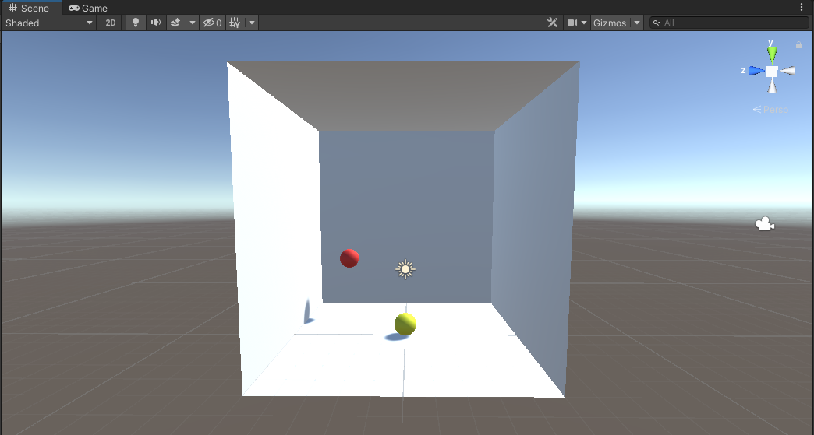

# Full Stack Deep Learning Course Project Write-Up

For my FSDL project I decided to learn about the basic theory and application of reinforcement learning in the <a href="https://unity.com/">Unity game engine</a>.

Unity Technologies provide a well-documented toolkit to carry out the training of agents in game environments, as such this was a convenient introduction point to RL for a beginner like me. Despite this, starting from zero knowledge of Unity or RL meant that there was a fair degree of learning curve in getting to successfully training an agent in a unique environment - this report will walk through the journey I took to get there.

## Getting started with Unity and the ML-Agents Toolkit - Installation and Basics

The Unity Machine Learning Agents Toolkit is an open-source project that allows anyone to easily apply state-of-the-art algorithms to agents in game environments. Installation was straightforward and consisted of:

- Installing Unity on my local machine
- Cloning the ML-Agents Toolkit repo to my local machine
- Installing the mlagents Python pacakge from PyPi
- Adding a package to my project within the Unity Game Engine itself (com.unity.ml-agents)

I then ran though <a href="https://github.com/Unity-Technologies/ml-agents/blob/release_17_docs/docs/Getting-Started.md">Getting Started Guide</a> to make sure the installation had completed correctly.

Before starting on ML-Agents I did the introductory tutorials on Unity itself to familiarise myself with the platform. I also watched this YouTube video: <a href="https://www.youtube.com/watch?v=pwZpJzpE2lQ">LEARN UNITY - The Most BASIC TUTORIAL I'll Ever Make</a> which was brilliant for the absolute beginner. 

Armed with my newfound Unity knowledge I moved onto the <a href="https://github.com/Unity-Technologies/ml-agents/blob/release_17_docs/docs/Learning-Environment-Create-New.md">Making a New Learning Environment<a> tutorial. I knew that I wanted to create a simple 3D environment conceptually very similar to this 2D example so it was a good starting point.

## Creating and training an agent in a simple environment


This simple scene is set up in Unity - a flat platform, a box (the target), and a rolling ball (the agent).

Everything in Unity is controlled with C# scripts, including agents. MLAgents has an <strong>Agent</strong> class that contains all the boilerplate code to run an agent in an environment, we simply inherit from this class and add the following additional behaviours:

- Move the target to a new position at the start of each episode
- Collect observations at some fixed time interval (the positions of target and agent, and the velocity of agent)
- Apply forces to the agent in the x and y directions
- Code to allow us to apply those forces manually using keyboard inputs (helpful for debugging)
- Add rewards when certain things occur

The rewards are what drive the learning algorithm. In this case we give a reward of 1 and end the episode if the agent hits the target (the episode ends if the agent rolls off the platform).

Rewards:
- Hit target - 1.0

ML-Agents is set up so that training is done separately in Python/PyTorch. This is carried out in a similar way to the FSDL text-recognizer labs, running a Python program through the command line using the mlagents-learn command. The main argument is a yaml config file that contains all the parameters for training, and there are additional optional arguments. I installed the mlagents package in an anaconda environment and kicked off training in this environment by running the following command:

```
mlagents-learn config/rollerball_config.yaml --run-id=rollerball_01
```

In RL, agents learn a policy that takes in some state of the environment and outputs actions. In this case the state is the observations described above (8 numbers - x, y and z coordinates for the agent and target, and the x and y components of the agent's velocity), and the actions are forces to apply on the rolling ball (2 numbers - forces in the ball's local x and y directions). How are these inputs mapped to outputs? A neural net. In this case two fully connected layers with 128 hidden units each.

My understanding it that the agent's policy in this case is a neural net with two fully connected layers, with 8 input numbers (x, y and z coordinates for the agent and target, and the x and y components of the agent's velocity), and 2 outputs (forces in the x and y direction).


ML-Agents provides Tensorboard integration so I was able to look at training progress for the average reward and episode length.


This was a simple task so it converged to a maximum average reward of 1 in less than 30k steps (10 minutes on my local potato-powered machine). 

## Some theory - RL and the PPO Algorithm

Part of my goal was to understand more about reinforcement learning, but of course this is a very big subject so I was only able to scratch the surface. Despite this, I did my best to understand the algorithm I used in ML-Agents to train my agents: Proximal Policy Optimization (PPO). PPO is an algorithm developed by OpenAI in 2017 with three broad goals:

- Ease of implementation
- Sample efficient
- Easy to tune

A few words on the later two of these goals. PPO is a policy gradient method, which means it learns directly from whatver the agent experiences (run a batch of sequences, use the rewards to calculate an objective function, back propagate the gradient to update the policy). The issue is that the policy gradient may use the information ineffieciently (for example, an episode which ends in a negative reward but during which the agent actually displayed desireable behaviours) - there is a credit assignment problem in a sparse reward setting. Which behaviours are actually causing the reward? RL algorithms can be very sample inefficient.

The training data is also dependent on the current policy, rather than a static dataset (e.g. with supervised learning), so the data distribution over observations and rewards are constantly changing. This can make it very unstable and sensitive to hyperparameters - for example, choosing a particular learning rate can cause training to fall into a local optima from which it cannot escape, because it cannot generate the data to do so.

PPO seeks to to update

## Moving from 2D to a 3D free body

Expanding this simple problem into three dimensions was a good way to increase the complexity of the problem, while still keeping a similar training and reward structure. To do this I simply added five more planes to create a cube, ensuring they were all facing inwards to contain the agent. I wanted the agent to be operating as if in space i.e. as a free body with no forces acting upon it. This would mean that the agent would need to learn how to accelerate and decelerate itself around the environment (similar to the rolling in two dimensions). To do this was simply a case of turning off gravity in the Unity environment, and allowing collisions with the boundary to be fully elastic. To increase the level of control required I also added a negative reward for the agent hitting the boundary.

Rewards:
- Hit target - 1.0
- Hit boundary - -0.5

Here's what the environment looked like.



All I needed to add to the C# script controlling the behaviour of the agent was an additional observation for the velocity of the agent in the z (vertical) direction, and the negative reward for a collision with the boundary. In the 2D plance there was an easy way for episodes to end by the agent sphere rolling off the edge, this was not the case now so I added a time limit to each episode of 1000 steps. Finally, since the problem had increased in complexity I also took advantage of the ability to run multiple environments simultaneously in Unity, adding a further 7 copies of the agent/target/box.


Once again I used the mlagents-learn command to run training, incrementing the run id to keep track of results, and increasing the maximum number of iterations to account for the increased complexity.

```
mlagents-learn config/rollerball_config.yaml --run-id=rollerball_02
```


Training progress is shown here in blue (alongside the previous run in orange), converging to 1 within 150k steps, around five times longer than previously. However, due to running eight parallel environment this only took 15 minutes on my machine, just 50% longer than the first challenge.

## Adding orientation control


## Directional observation using rays

## Visual observation

## Summary and learnings
